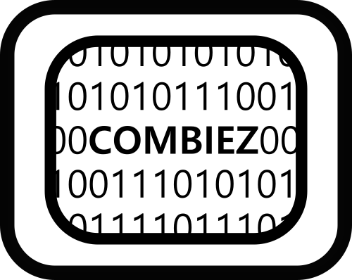

<!-- PROJECT LOGO -->
<br />
<div align="center">
  <a href="#">
    
  </a>

<h3 align="center">LBL Trucking CRM</h3>

  <p align="center">
    Customer management built with microservices
  </p>
</div>


<!-- TABLE OF CONTENTS -->
<details>
  <summary>Table of Contents</summary>
  <ol>
    <li>
      <a href="#about-the-project">About The Project</a>
      <ul>
        <li><a href="#built-with">Built With</a></li>
      </ul>
    </li>
    <li>
      <a href="#getting-started">Getting Started</a>
      <ul>
        <li><a href="#prerequisites">Prerequisites</a></li>
        <li><a href="#installation">Installation</a></li>
      </ul>
    </li>
    <li><a href="#usage">Usage</a></li>
    <li><a href="#roadmap">Roadmap</a></li>
    <li><a href="#contributing">Contributing</a></li>
    <li><a href="#license">License</a></li>
    <li><a href="#contact">Contact</a></li>
    <li><a href="#acknowledgments">Acknowledgments</a></li>
  </ol>
</details>


<!-- ABOUT THE PROJECT -->
## About The Project
This is a Customer Relationship Manager built using microservices architecture.
It consists of eight different services. Some to handle interaction, routing and service configuration, while the rest provide different features.

Services:
* Discovery Service: Uses eureka server to monitor state and information about other services.
* Gateway Service: Provides centralized routing to other services.
* Configuration Service: Allows for external configuration of other services properties. It does so by fetching the properties from a unique git repository containing a file for configuration of each service.
* Main Service: Provides functionality that involves calling more than one other service, i.e. convert leads.
* Report Service: For all report requirements. i.e opportunities closed-won by city.
* Lead Service: Creates, modifies and fetches lead related data.
* Contact Service: Creates, modifies and fetches contact related data.
* Sales Rep Service: Creates, modifies and fetches sales representative related data.
* Opportunity Service: Creates, modifies and fetches opportunity related data.
* Account Service: Creates, modifies and fetches account related data.

<p align="right">(<a href="#top">back to top</a>)</p>


### Built With

Technologies used for this project:

* [Java](https://www.java.com)
* [Spring](https://spring.io/)
* [H2 Database](https://www.h2database.com/html/main.html)
* [GitHub](https://github.com/)

<p align="right">(<a href="#top">back to top</a>)</p>


<!-- GETTING STARTED -->
## Getting Started

### Prerequisites

* Java Development Kit (JDK 17 recommended)
  ```sh
  For a different JDK just change the java.version inside the 
  project application.properties
  ```
* Postman
    * Available at the [Postman website](https://www.postman.com/downloads/).


### Installation

To run the application:

1. Create a directory and navigate to it.
2. Run in the command line:
   ```sh
   git clone https://github.com/EN-IH-WDPT-JUN21/GroupD-crm-discovery.git
   ```
3. Run the application file in each one.

4. Verify all services are running by navigating to:
   ```sh
   http://localhost:8761/
   ```

<p align="right">(<a href="#top">back to top</a>)</p>


<!-- USAGE EXAMPLES -->
## Usage

To check service response run any of the following request in Postman. Use a basic Auth when requesting (user : 'admin' / password : 'admin'). Include path variable, params or body (raw/json) when necessary:

* Sales Rep:
```sh
GET: http://localhost:8100/salesRep/{id}
GET: http://localhost:8100/salesRep (all sales reps)
POST: http://localhost:8100/salesRep
DELETE: http://localhost:8100/salesRep/{id}
```
```sh
{
    "name": "Batman"
}
```
* Lead:
```sh
GET: http://localhost:8100/lead/{id}
GET: http://localhost:8100/lead/all (all leads)
GET: http://localhost:8100/lead/count-by-salesrep (leads by salesrep)
POST: http://localhost:8100/lead/new
DELETE: http://localhost:8100/lead/{id}
```
```sh
{
    "name": "Roger Rabbit",
    "phoneNumber": "32123456789",
    "email": "roger@rabbit.io",
    "companyName": "Toon Inc",
    "salesRepId": "1" 
}
```
* Convert Lead: pass an id between 1 and 10
```sh
POST: http://localhost:8100/convert/{id}
```
```sh
{
    "product": "BOX",
    "quantity": "42",
    "industry": "PRODUCE",
    "employeeCount": 1000,
    "city": "Gotham",
    "country": "USA"
}
```
* Report: the type of report is found at the end of the uri
```sh
GET: http://localhost:8100/report/leads/count-by-salesrep
GET: http://localhost:8100/report/opportunities/count-by-salesrep
GET: http://localhost:8100/report/opportunities/count-by-salesrep/{status}
GET: http://localhost:8100/report/opportunities/count-by-product
GET: http://localhost:8100/report/opportunities/count-by-product/{status}
GET: http://localhost:8100/report/opportunities/count-by-country
GET: http://localhost:8100/report/opportunities/count-by-city
GET: http://localhost:8100/report/opportunities/count-by-city{status}
GET: http://localhost:8100/report/opportunities/count-by-industry
GET: http://localhost:8100/report/opportunities/mean
GET: http://localhost:8100/report/opportunities/median
GET: http://localhost:8100/report/opportunities/max
GET: http://localhost:8100/report/opportunities/min
GET: http://localhost:8100/report/opportunities/mean-by-account
GET: http://localhost:8100/report/opportunities/median-by-account
GET: http://localhost:8100/report/opportunities/max-by-account
GET: http://localhost:8100/report/opportunities/min-by-account
GET: http://localhost:8100/report/employeeCount/mean
GET: http://localhost:8100/report/employeeCount/median
GET: http://localhost:8100/report/employeeCount/max
GET: http://localhost:8100/report/employeeCount/min
```

<p align="right">(<a href="#top">back to top</a>)</p>


<!-- ROADMAP -->
## Roadmap

- [] Required authentication using Spring Security
- [] Add front-end UI using the Angular framework

<p align="right">(<a href="#top">back to top</a>)</p>


<!-- CONTRIBUTING -->
## Contributing

Contributions are what make the open source community such an amazing place to learn, inspire, and create. Any contributions you make are **greatly appreciated**.

If you have a suggestion that would make this better, please fork the repo and create a pull request. You can also simply open an issue with the tag "enhancement".
Don't forget to give the project a star! Thanks again!

1. Fork the Project
2. Create your Feature Branch (`git checkout -b feature/AmazingFeature`)
3. Commit your Changes (`git commit -m 'Add some AmazingFeature'`)
4. Push to the Branch (`git push origin feature/AmazingFeature`)
5. Open a Pull Request

<p align="right">(<a href="#top">back to top</a>)</p>


<!-- LICENSE -->
## License

Distributed under the MIT License. See `LICENSE.txt` for more information.

<p align="right">(<a href="#top">back to top</a>)</p>


<!-- CONTACT -->
## Contact

Gustavo Maldonado - [GitHub](https://github.com/GustavoM01)

Lee Dawson - [GitHub](https://github.com/evildwells1982)

Mara Fernandez - [GitHub](https://github.com/MaraFdez)

Varvara Nechaeva - [GitHub](https://github.com/VarvaraNechaeva)


Project Link: [https://github.com/EN-IH-WDPT-JUN21/GroupD-crm-discovery](https://github.com/EN-IH-WDPT-JUN21/GroupD-crm-discovery)

<p align="right">(<a href="#top">back to top</a>)</p>


<!-- ACKNOWLEDGMENTS -->
## Acknowledgments

* [Ironhack Team](https://www.ironhack.com)

<p align="right">(<a href="#top">back to top</a>)</p>


<!-- MARKDOWN LINKS & IMAGES -->
<!-- https://www.markdownguide.org/basic-syntax/#reference-style-links -->
[contributors-shield]: https://img.shields.io/github/contributors/othneildrew/Best-README-Template.svg?style=for-the-badge
[contributors-url]: https://github.com/othneildrew/Best-README-Template/graphs/contributors
[forks-shield]: https://img.shields.io/github/forks/othneildrew/Best-README-Template.svg?style=for-the-badge
[forks-url]: https://github.com/othneildrew/Best-README-Template/network/members
[stars-shield]: https://img.shields.io/github/stars/othneildrew/Best-README-Template.svg?style=for-the-badge
[stars-url]: https://github.com/othneildrew/Best-README-Template/stargazers
[issues-shield]: https://img.shields.io/github/issues/othneildrew/Best-README-Template.svg?style=for-the-badge
[issues-url]: https://github.com/othneildrew/Best-README-Template/issues
[license-shield]: https://img.shields.io/github/license/othneildrew/Best-README-Template.svg?style=for-the-badge
[license-url]: https://github.com/othneildrew/Best-README-Template/blob/master/LICENSE.txt
[linkedin-shield]: https://img.shields.io/badge/-LinkedIn-black.svg?style=for-the-badge&logo=linkedin&colorB=555
[linkedin-url]: https://linkedin.com/in/othneildrew
[product-screenshot]: images/screenshot.png
